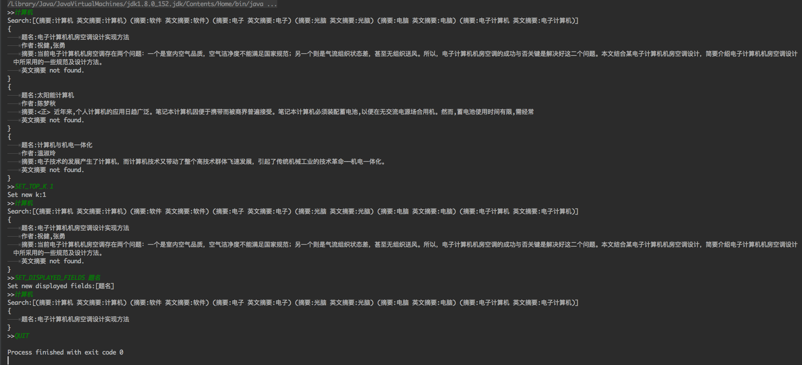
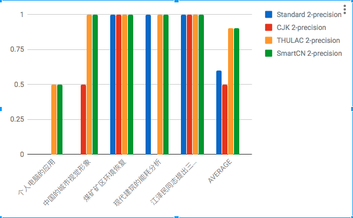
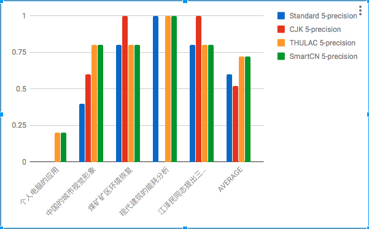
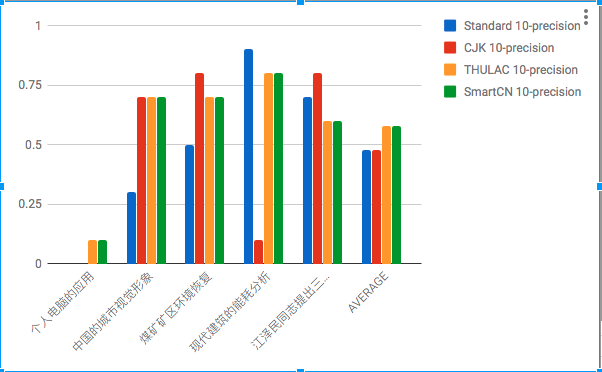
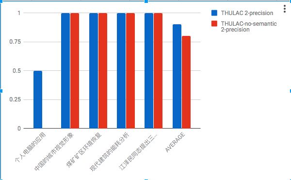
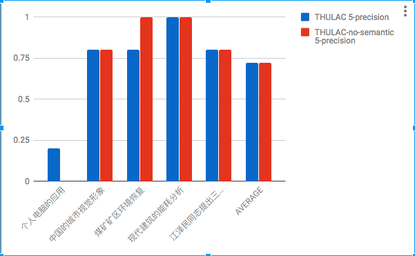
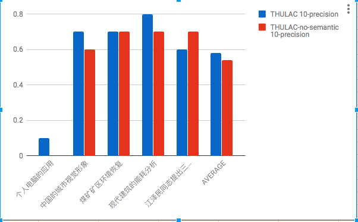

# 信息检索大作业报告

*2014011292 计42 李则言*

------

## 使用Lucene搭建基本的检索系统

### 索引构建

提供的数据集是知网论文的元数据，但是有的属性对于这次大作业要实现的信息检索系统意义有限。所以我只选择一些属性作为要使用的域构建索引：

-   题名
-   作者
-   摘要
-   英文摘要
-   来源
-   出版单位

具体地讲，搭建索引的过程首先是解析源数据。将每篇文档作为一个`Document` ，每个（上面列出的）字段作为一个`TextField`， 然后构建文档的集合。

```java
private void newField(String key) {
  assert this.currentDocument != null;
  if (this.currentFieldName != null && this.currentFieldValue != null) {
    switch (this.currentFieldName)
    {
      case "摘要":
      case "题名":
      case "作者":
      case "英文摘要":
      case "来源":
      case "出版单位":
        this.currentDocument.add(new TextField(this.currentFieldName, this.currentFieldValue, Field.Store.YES));
        break;
    }
  }
  this.currentFieldName = key;
  this.currentFieldValue = null;
}

private void newDocument() {
  if (this.currentDocument != null) {
    this.documentList.add(this.currentDocument);
  }
  this.currentDocument = new Document();
  this.currentFieldName = null;
  this.currentFieldValue = null;
}
```


第二步是根据构建的`Document`的集合构建索引。

```java
IndexWriterConfig indexWriterConfig = new IndexWriterConfig(this.analyzer);
indexWriterConfig.setOpenMode(IndexWriterConfig.OpenMode.CREATE);
IndexWriter indexWriter = new IndexWriter(this.indexDirectory, indexWriterConfig);
indexWriter.addDocuments(documentList);
indexWriter.close();
```

`this.analyser`是一个`Analyzer`， 会负责将每个`Field`的内容解析成`Term`的序列，比如分词就是由它进行的。

`this.indexDirectory`是保存索引的地址，可以是文件系统中的某个目录或者是内存：

```java
Directory directory = FSDirectory.open(Paths.get("index/standard"));
Directory directory = new RAMDirectory();
```

### 查询

首先需要指定`QueryParser`:

```java
String[] fields = {"摘要", "英文摘要"};
this.parser = new MultiFieldQueryParser(fields, analyzer);
```

Lucene的query语法是可以指定要检索的域的，这里指定的`fields`是默认的域。`analyzer`会将query的内容解析成`Term`。

然后对于每一句query，使用`QueryParse`将其解析成`Qeury`然后可以得到top k的文档:

```java
public List<Document> search(String queryText, int k)
{
  List<Document> result = new ArrayList<>();
  try {
    Query query = this.parser.parse(queryText);
    System.out.println("Search:[" + query + "]");
    ScoreDoc[] hits = this.searcher.search(query, k).scoreDocs;
    // Iterate through the results:
    for (ScoreDoc hit : hits) {
      Document hitDoc = this.searcher.doc(hit.doc);
      result.add(hitDoc);
    }
  }
  catch (IOException | ParseException e) {
    System.err.println("[ERROR]: unable to do query");
    e.printStackTrace(System.err);
  }
  return result;
}
```

### CLI（Command Line Interface）

作为一个信息检索系统要有用户接口，我实现了一个非常简单的命令行接口：

-   输入检索内容，检索top k文档并返回文档的某些域的内容
-   输入`SET_TOP_K top_k`，设置检索文档的树木
-   输入`SET_DISPLAY_FIELDS fields`，设置显示的域的列表
-   输入`QUIT`，退出。

示例：



## 不同分词方法效果的探究

### 尝试过的分词方法实现

#### 单字索引

Lucene自带的`StandardAnalyzer`,对于中文采用的是单字分词，实际上就是按字建立索引。它对于英文采用的是空白字符分词，然后统一为小写并且去除停用词。对于英文来说基本是可以满足基本需求的，但是对于中文来说单字分词是远远不够的。

#### bigram（二元分词）

Lucene自带的CJKAnalyzer采用了二元分词。

#### THULAC

我基于清华大学自然语言处理与社会人文计算实验室的[THULAC工具](http://thulac.thunlp.org)的Java版本自己实现了一个Tokenizer，用它来定制`Analyzer`。

具体来说，首先在Analyzer提供的输入流中读取，直到遇到结束符（正则表达式定义为`[，。；：！？《》（）【】「」·～,.!?<>;()\\[\\]{}\\s]`），就认为读取完了一句话。之后调用THULAC对这一句话进行分词，将分好的`Token`传递出去。

下面的类定义了如何从一个包装好的分词器（拥有将一个`String`分割成`List<String>`的接口）实现一个`Tokenizer`

```java
public class CutterTokenizer extends Tokenizer {

    private Scanner scanner;
    private int position = 0;

    private CharTermAttribute charAttr =
            addAttribute(CharTermAttribute.class);
    private TypeAttribute typeAttr = addAttribute(TypeAttribute.class);
    private final PositionIncrementAttribute positionAttr =
            addAttribute(PositionIncrementAttribute.class);
    private final OffsetAttribute offsetAtt = addAttribute(OffsetAttribute.class);
    private Cutter cutter;
    private List<String> segs = new LinkedList<>();

    public CutterTokenizer(Cutter cutter)
    {
        this.cutter = cutter;
    }

    @Override
    public boolean incrementToken() throws IOException {
        clearAttributes();

        while (this.scanner.hasNext())
        {
            String token = this.scanner.next();
            segs.addAll(this.cutter.cut(token));
        }

        if (segs.size() > 0) {
            String word = segs.remove(0);
            charAttr.append(word);
            typeAttr.setType("Word");
            positionAttr.setPositionIncrement(position + word.length());
            offsetAtt.setOffset(correctOffset(position), correctOffset(position + word.length()));

            return true;
        }
        else{
            return false;
        }
    }

    @Override
    public void reset() throws IOException {
        super.reset();
        this.position = 0;
        this.scanner = new Scanner(this.input).useDelimiter("[，。；：！？《》（）【】「」·～,.!?<>;()\\[\\]{}\\s]");
    }
```

下面的类说明了如何把THULAC包装成上面用到的分词器

```java
public class THULACCutter implements Cutter {
    private CBTaggingDecoder cws_tagging_decoder = new CBTaggingDecoder();
    private Preprocesser preprocesser = new Preprocesser();
    private Postprocesser nsDict;
    private Postprocesser idiomDict;
    private Punctuation punctuation;
    private TimeWord timeword;
    private NegWord negword;

    public THULACCutter()
    {
        try {
            init_thulac();
        }
        catch (IOException e)
        {
            System.err.println("[ERROR]:init cutter.THULACCutter cutter failed.");
            e.printStackTrace(System.err);
        }
    }
    private void init_thulac() throws IOException
    {
        Character separator = '_';
        String prefix = "data/thulac_models/";
        this.cws_tagging_decoder.threshold = 0;
        this.cws_tagging_decoder.separator = separator;
        this.cws_tagging_decoder.init((prefix+"cws_model.bin"),(prefix+"cws_dat.bin"),(prefix+"cws_label.txt"));
        this.cws_tagging_decoder.setLabelTrans();
        this.preprocesser.setT2SMap((prefix+"t2s.dat"));
        this.nsDict = new Postprocesser((prefix+"ns.dat"), "ns", false);
        this.idiomDict = new Postprocesser((prefix+"idiom.dat"), "i", false);
        this.punctuation = new Punctuation((prefix+"singlepun.dat"));
        this.timeword = new TimeWord();
        this.negword = new NegWord((prefix+"neg.dat"));
    }
    public List<String> cut(String sentence)  {
        POCGraph poc_cands = new POCGraph();
        TaggedSentence tagged = new TaggedSentence();
        SegmentedSentence segged = new SegmentedSentence();
        String raw = preprocesser.clean(sentence,poc_cands);
        if(raw.length()>0) {
            this.cws_tagging_decoder.segment(raw, poc_cands, tagged);
            this.cws_tagging_decoder.get_seg_result(segged);
            this.nsDict.adjust(segged);
            this.idiomDict.adjust(segged);
            this.punctuation.adjust(segged);
            this.timeword.adjust(segged);
            this.negword.adjust(segged);
        }
        return segged;
    }
}
```

#### SmartChinese

lucene自带的中文分词器。按照文档的介绍，这个`Analyzer`使用了HMM模型进行中文分词，可以进行中文或者中英文混合的分词。

### 效果对比

检索和索引使用相同的`Analyzer`，检索的域是"摘要"。

首先直接对比几个分词器的分词效果

| Query                          | 单字索引                                     | bigram                                                       | THULAC                                | SmartCN                               |
| ------------------------------ | -------------------------------------------- | ------------------------------------------------------------ | ------------------------------------- | ------------------------------------- |
| 个人电脑的应用                 | 个/人/电/脑/的/应/用                         | 个人/人电/电脑/脑的/的应/应用                                | 个人/电脑/的/应用                     | 个人/电脑/的/应用                     |
| 中国的城市视觉形象             | 中/国/的/城/市/视/觉/形/象                   | 中国/国的/的城/城市/市视/视觉/觉形/形象                      | 中国/的/城市/视觉/形象                | 中国/的/城市/视觉/形象                |
| 煤矿矿区环境恢复               | 煤/矿/矿/区/环/境/恢/复                      | 煤矿/ 矿矿/矿区/区环/环境/境恢/恢复                          | 煤矿/矿区/环境/恢复                   | 煤矿/矿区/环境/恢复                   |
| 现代建筑的能耗分析             | 现/代/建/筑/的/能/耗/分/析                   | 现代/代建/建筑/筑的/的能/能耗/耗分/分析                      | 现代/建筑/的/能耗/分析                | 现代/建筑/的/能耗/分析                |
| 江泽民同志提出三个代表重要思想 | 江/泽/民/同/志/提/出/三/个/代/表/重/要/思/想 | 江泽/泽民/民同/同志/志提/提出/出三/三个/个代/代表/表重/重要/要思/思想 | 江泽民/同志/提出/三/个/代表/重要/思想 | 江泽民/同志/提出/三/个/代表/重要/思想 |

可以看出单字索引只能区分到单个汉字，但是现代汉语一般都不会使用单字表达完整的意思。bigram试图去遍历句子中所有的双子词组，但是会产生很多没有意义的`Term`。THULAC和SmartCN都是使用了机器学习的模型，对于正常的汉语句子的分词都能达到很高的水准。

然后对比它们在以下一些查询的top N准确率（这里的结果已经使用了下面会讲到的word2vec构建索引）







可以看到，总的来看THULAC和SmartCN是远超前两种简单的分词方案的，因为这两种分词方案可以说最接近汉语本身的语义。

但是值得注意的是单字索引取得的效果超过了bigram，这可能是因为bigram有许多无意义或者会导致歧义的分词结果。由此可见bigram一个简单但是应该会很有效的改进是建立一个固定的汉语词典，只对所有不在这个汉语词典中的部分进行这种遍历式的二元分词，而在辞典中存在的部分直接使用已知的词组作为分词结果。

## 多域检索

### 实现方法

Lucene本身就支持多域检索，支持不同域的检索进行布尔运算的。

基本的语法大致如下：

-   [term]:[term] 冒号前的term表示要检索的域，冒号后是要检索的文本。如果是默认的域，可以没有第一个term和冒号。
-   检索之间支持`AND` `OR` `NOT`运算，空格隔开默认是`OR`

### 效果展示

以下三个例子展示了在多个域进行检索并且进行布尔运算

```
>>作者:张红梅
Search:[作者:张红梅]
{
	题名:水电工程区迁移农户安置情况调查——以大渡河中游的一个水电工程为例
	作者:张红梅;王晓东;吴春燕;
	摘要:本文通过对水电工程区移民农户意愿调查结果进行分析,发现农户的行为选择与其家庭经济收入构成、谋生技能、各种选择行为利益获得及农户对未来的预期有很大关系,为正确制订农村移民安置规划提供借鉴。
	英文摘要 not found.
}
{
	题名:柱前衍生反相液相色谱法测定饲料中氨基酸含量
	作者:张红梅;朱洪亮;费贤明;周红;
	摘要:采用邻苯二甲醛-氯甲酸芴甲酯(OPA-FMOC)柱前衍生反相高效液相色谱法测定饲料中17种氨基酸含量,以C18柱为分析柱,采用荧光检测器,25min内17种氨基酸得到了分离。氨基酸浓度在10-1000pmol/ul范围内,其峰面积与氨基酸浓度的线性相关系数均大于0.996,17种氨基酸的加标回收率在83.9%-109.8%范围内。试验结果表明本方法具有操作简单、灵敏度高,适用于饲料中氨基酸的测定。
	英文摘要:A method using precolumn derivatization with o-phthaldialdehyde(OPA) and fluorenylmethyl chloroformate(FMOC chloride) was used in the study on the determination of amino acids in feed by RP-HPLC.The analysis was accomplished within 25 min by using C18 column.RP-HPLC followed by FLD detection.When the amino acid concentration ranged within 10~1000pmol/ul,the correlation coefficients of amino acid peak area to amino acid concentration were all above 0.996,and the recovery percentage of standard addition of amino acid were 83.9%~109.8%.The method is simple,but it is sensible and accurate,and could be applied for determination of amino acid in feed.
}
{
	题名:植物毒素及其在农业上的应用
	作者:陈素华;顾和平;陈新;张红梅;姜晓宁;张琤琤;
	摘要:本文综述了植物毒素的种类、形成机制及其在农业科学中的应用。植物毒素主要包括五大类,即非蛋白质氨基酸、生物碱、蛋白质毒素、不含氮毒素和生氰糖苷类毒素。植物毒素的产生主要缘于植物在系统发育过程中的自我保护和防御机制,对某些化学元素的富集机制,以及植物在数亿年的遗传分化中,在各种环境的影响和遗传物质发生改变的双重作用下形成的生物多样化。植物毒素在农业科学中的应用包括生产植物源杀虫剂、杀草剂、天然植物激素,并有望从植物毒素的化学结构分析中,找出新型除草剂的先导结构。
	英文摘要 not found.
}
```

```
>>作者:张红梅 AND 题名:水电
Search:[+作者:张红梅 +题名:水电]
{
	题名:水电工程区迁移农户安置情况调查——以大渡河中游的一个水电工程为例
	作者:张红梅;王晓东;吴春燕;
	摘要:本文通过对水电工程区移民农户意愿调查结果进行分析,发现农户的行为选择与其家庭经济收入构成、谋生技能、各种选择行为利益获得及农户对未来的预期有很大关系,为正确制订农村移民安置规划提供借鉴。
	英文摘要 not found.
```

```
>>作者:张红梅 AND NOT 题名:水电
Search:[+作者:张红梅 -((摘要:题名 英文摘要:题名) (摘要:水电 英文摘要:水电))]
{
	题名:柱前衍生反相液相色谱法测定饲料中氨基酸含量
	作者:张红梅;朱洪亮;费贤明;周红;
	摘要:采用邻苯二甲醛-氯甲酸芴甲酯(OPA-FMOC)柱前衍生反相高效液相色谱法测定饲料中17种氨基酸含量,以C18柱为分析柱,采用荧光检测器,25min内17种氨基酸得到了分离。氨基酸浓度在10-1000pmol/ul范围内,其峰面积与氨基酸浓度的线性相关系数均大于0.996,17种氨基酸的加标回收率在83.9%-109.8%范围内。试验结果表明本方法具有操作简单、灵敏度高,适用于饲料中氨基酸的测定。
	英文摘要:A method using precolumn derivatization with o-phthaldialdehyde(OPA) and fluorenylmethyl chloroformate(FMOC chloride) was used in the study on the determination of amino acids in feed by RP-HPLC.The analysis was accomplished within 25 min by using C18 column.RP-HPLC followed by FLD detection.When the amino acid concentration ranged within 10~1000pmol/ul,the correlation coefficients of amino acid peak area to amino acid concentration were all above 0.996,and the recovery percentage of standard addition of amino acid were 83.9%~109.8%.The method is simple,but it is sensible and accurate,and could be applied for determination of amino acid in feed.
}
{
	题名:植物毒素及其在农业上的应用
	作者:陈素华;顾和平;陈新;张红梅;姜晓宁;张琤琤;
	摘要:本文综述了植物毒素的种类、形成机制及其在农业科学中的应用。植物毒素主要包括五大类,即非蛋白质氨基酸、生物碱、蛋白质毒素、不含氮毒素和生氰糖苷类毒素。植物毒素的产生主要缘于植物在系统发育过程中的自我保护和防御机制,对某些化学元素的富集机制,以及植物在数亿年的遗传分化中,在各种环境的影响和遗传物质发生改变的双重作用下形成的生物多样化。植物毒素在农业科学中的应用包括生产植物源杀虫剂、杀草剂、天然植物激素,并有望从植物毒素的化学结构分析中,找出新型除草剂的先导结构。
	英文摘要 not found.
}
{
	题名:日本生物能源研究的进展
	作者:杨欣;顾和平;陈新;易金鑫;张红梅;
	摘要:日本生物能源的研究已经进行了20多年。该项工作主要集中在能源生物的生产和生物能源的转化上,具体表现在以下四个方面:(1)生物体产生甲醇的新颖汽化系统的研究;(2)通过自然产生的细菌的共培养和专用型分解酶,使纤维素和半纤维素生物材料转化为乙醇的研究;(3)分离和浓缩生物发酵中产生的乙醇的生物膜技术研究;(4)牲畜粪便半固体甲烷发酵系统的研究。在日本,水稻稻壳、秸秆和米糠是主要的生物资源,这些水稻残体通常被认为是主要的生物能源利用原料。
	英文摘要:Japan has been studying biomass energy development for more than two decades.The major focuses of the studies are biomass production and conversion to energy,The author discussed the importance from four aspects listed below:(1)a novel steam gasification system for methanol production from biomass;(2)the technologies of converting cellulosic and hemicellulosic materials into ethanol using a naturally occurring bacterial coculturel and genetically modified enzymes;(3)the membrane technologies for ethanol seperation and concentration;(4) a semisolid methane fermentation system for swine excreta.
}
```


## 与Word2Vec的结合

### 实现方法

使用Word2Vec的目的是为了能够实现简单的语义检索，也就是说是根据检索的语义而不是文本本身去匹配。

要与Lucene这个文本检索系统结合的话，一个比较简单的方案是在构建索引的时候自动把每一个词拓展为它自己和它的几个由word2vec得到的近义词

具体地说，我实现了一个`TokenFilter`，对于上一层`TokenStream`传入的每一个Token，都会查询它的近义词并拓展为多个Token。

### 效果展示

首先我们检查是否可以检索到同义词（使用THULAC分词器，下面的所有检索均保证把整个检索内容认为是一个`Term`）：

| 检索      | Top1题名                               | Top2题名                               | Top3题名                                     | Top4题名                                   | Top5题名                                 |
| --------- | -------------------------------------- | -------------------------------------- | -------------------------------------------- | ------------------------------------------ | ---------------------------------------- |
| 题名:电脑 | 太阳能计算机                           | 计算机与机电一体化                     | 混凝土拱坝的计算机仿真                       | “手机银行”及其发展                         | 并行处理与并行计算机                     |
| 题名:泥土 | 应用土壤调理剂改良土壤结构技术         | 土壤酸化及酸性土壤的改良和管理         | 花卉土壤消毒                                 | 安庆市耕地土壤质地概况及其对土壤肥力的影响 | 武夷山不同垂直地带土壤理化性质和土壤类型 |
| 题名:房屋 | 现代亭建筑——浓缩现代建筑特征的小品建筑 | 生态建筑与绿色建筑                     | 地域建筑创作与建筑形象                       | 房屋建筑温度裂缝防控刍议                   | 房屋建筑施工管理的现代化问题             |
| 题名:山楂 | 无花果发展研究                         | 话说枸杞                               | 枸杞栽培技术                                 | 槟榔的临床应用                             | 槟榔寒害调查研究                         |
| 题名:测量 | 辣椒组合力测定                         | 全站仪水平角观测精度自我测定的方法探讨 | 高效液相色谱法测定败酱草片中芍药苷的含量测定 | 频率法测定拉索索力                         | 软土路基的沉降观测                       |

明显地，通过引入Word2Vec得到的近义词，我们可以使用在论文中比较少出现的口语化的词检索到含有相关的书面语的文档。但是上面”山楂“的例子展示了这种方案的一个弊端，那就是word2vec得到的相关词不一定是近义词，比如”山楂“和”枸杞“也许经常一起出现，但他们语义上的关系没那么大，事实上是不应该检索得到的。

接下来我们看看没有Word2Vec索引的precision变化。只比较THULAC分词器的结果变化。







显然引入了word2vec为基础的语义检索后精度得到的一定的提高。

## 跨语言检索

### 实现方法

要实现的目标是通过英文查询中文文档。我采用的方法是文档翻译的做法（主要是考虑到源数据中已经有了"摘要"对应的翻译"英文摘要"，文档翻译实现跨语言检索非常自然）

### 效果展示

| 检索                            | Top1题名                                   | Top2题名                                       | Top3题名                                   | Top4题名                                 | Top5题名                               |
| ------------------------------- | ------------------------------------------ | ---------------------------------------------- | ------------------------------------------ | ---------------------------------------- | -------------------------------------- |
| computer                        | 汽车拖拉机电气系统多媒体教学软件的优化设计 | 并行处理与并行计算机                           | 试论网络多媒体辅助有机化学教学             | 计算机仿真技术在水资源与环境问题上的应用 | 《园艺育种学》CAI课件在教学上的应用    |
| building energy                 | 试析居住建筑节能控制方法                   | 外墙保温砂浆施工技术要点                       | 节能技术在“东方金座”商住楼围护结构中的应用 | 低能耗居住建筑设计方法探讨               | 谈建筑节能监督检查中常见的质量问题     |
| president jiang                 | 戴震与江永关系的再探讨                     | 论江泽民的科教兴农战略思想                     | 试析江泽民反腐倡廉思想的思维方法           | 安徽省长江江堤主要工程地质问题研究       | 论江泽民公平效率思想的主要理论贡献     |
| information technology in china | 信息与通讯技术背景下教师专业技能培养       | 医院信息系统集成总体设计思想及具体实施方案选择 | 安徽省农村信息基础设施建设现状及其发展策略 | 信息技术在项目施工管理中的应用分析       | 中国农业信息化技术支持体系的发展及建议 |
| gene engineering                | 基因工程在种植业上的应用及其对策           | 植物抗旱基因工程研究进展                       | 牛肠激酶次特异性识别序列分析               | 基因工程实验的改革与实践                 | 高等植物特异启动子研究现状             |


------

*以上展示的实验统计数据在[Google Doc](https://docs.google.com/spreadsheets/d/1elN8qM3FTYeXDzp8-Tdr_9IyMzl-HVMKAxQkpIA2mfA/edit#gid=0)*


